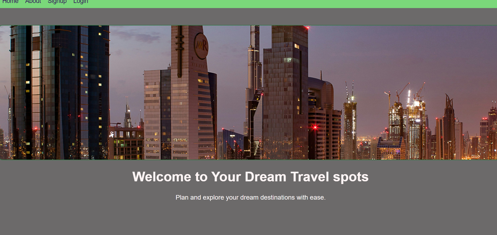

# 🌍 Travel & Tour App

A full-featured web application for exploring travel destinations, planning tours, and managing bookings.

## ✨ Features

- 🗺️ Browse popular destinations
- 📝 User registration and login
- ❤️ Add destinations to favorites or wishlist
- ✨ Protected Routes
- ⭐ Leave reviews/Feedbacks
- 🔒 Hashed Password for security

## 🚀 Tech Stack

- **Frontend:** React
- **Backend:** Node.js, Express.js
- **Database:** MongoDB
- **Authentication:** JWT, bcrypt
- **Deployment:** (e.g., Vercel + Render)

